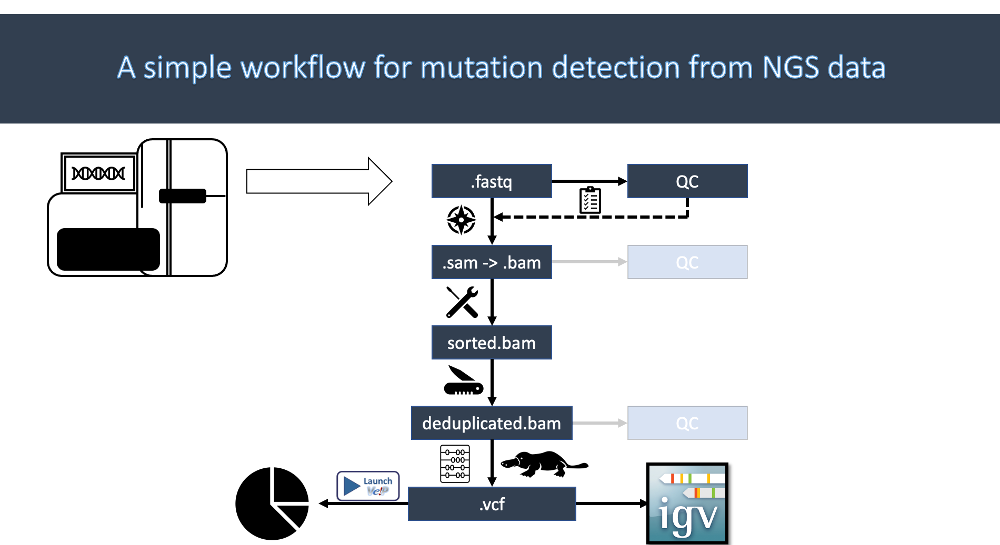

# Command-line Genomics: Day2

## Wrokflow:



1. Downloading sequence files
2. Downloading Reference genome file
3. QC sequence files
4. Indexing the Genome file
5. Mapping sequence files to Reference genome
6. Converting SAM to BAM file
7. Sorting BAM file
8. Deduplication of sorted BAM
9. Mutation detection from deduplicated-sorted BAM
10. Visualisation of mutations
11. Annotation of mutations

## Preparing your environment:
First thing first- open your terminal, navigate to the folder of your computer you want to be in. Now type: 
```
docker run -it -v your_PC_directory:/data ammhasan/biotedlinux:v4
```
If you are not unsure about `your_PC_directory`, type in `pwd` to check where you are right now. Let's create three directories where we will save our data and the results -
```
mkdir -p seq_data
mkdir -p ref_genome
mkdir -p result
```

## 1. Downloading sequence files
Let's download the downsampled, anonymised whole genome sequencing data in [fastq](https://samtools.github.io/hts-specs/SAMv1.pdf) format and save in the `seq_data` directory - 
```
cd seq_data
git clone https://github.com/AMMHasan/BioTED_Genomics_sampleR1.fq.git
git clone https://github.com/AMMHasan/BioTED_Genomics_sampleR2.fq.git
ls
mv BioTED_Genomics_sampleR*/*fq ./
rm -r BioTED_Genomics_sampleR*
```

## 2. Downloading Reference genome file
Now, download the reference genome (chrX from hg19) from public repository. This may take few minutes depending your internet connection. The file is downloaded as compressed (`.gz`) format, you need to decompress it using `gunzip` commad.
```
cd ../ref_genome
wget http://hgdownload.soe.ucsc.edu/goldenPath/hg19/chromosomes/chrX.fa.gz
gunzip chrX.fa.gz
less chrX.fa 
```

## 3. QC sequence files
Before mapping the sequences to the reference genome, we need to perform some QC on the sequence file to check the overall quality and some other parameters.

```
cd ../seq_data/
fastqc sample_R1.fq
fastqc sample_R2.fq
unzip sample_R1_fastqc.zip
unzip sample_R2_fastqc.zip
cd sample_R1_fastqc
head fastqc_data.txt
```
## 4. Indexing the Genome file
One more thing we need to perform before mapping is to index the reference genome. The reason for indexing will be discussed in the lecture.

```
cd ../../ref_genome
bwa index chrX.fa
ls
```
## 5. Mapping sequence files to Reference genome
Pair-end sequence files are now mapped to the reference genome. The output is in `.sam` (Sequence Alignment Map) format.

```
cd ..
bwa mem -M ./ref_genome/chrX.fa ./seq_data/sample_R1.fq ./seq_data/sample_R2.fq > ./seq_data/result/unsorted_sample.sam
ls result
```
## 6. Converting SAM to BAM file
As `.sam` format is a big text file to deal with, for computational purpose, it is converted into a binary format `.bam`. This is machine readable format, not human readable at all.

```
samtools view -S -b ./results/unsorted_sample.sam  > /data/result/unsorted_sample.bam
```
## 7. Sorting BAM file
Now, the reads are sorted in the alignment file -

```
samtools sort -o ./result/sorted_sample.bam ./result/unsorted_sample.bam
```
## 8. Deduplication of sorted BAM
To remove duplicated reads in the alignment file, deduplication has become an indespensible part for the whole genome sequence data analysis. 

```
picard MarkDuplicates I=/data/result/sorted_sample.bam O=/data/result/deduped_sample.bam M=/data/result/dedupMat.txt REMOVE_DUPLICATES=true
samtools index /data/result/deduped_sample.bam
```
## 9. Mutation detection from deduplicated-sorted BAM
Mutation is detected from the sample anlignment file using `Platypus`. It's worth mentioning that the mutations found here are the variants found when compared to the reference genome. The output will be given in `.vcf` format. Detection of meaningful somatic mutations are out of the scope of this workshop -

```
platypus callVariants -o /data/result/vatiants.vcf --refFile /data/ref_genome/chrX.fa --bamFiles /data/result/deduped_sample.bam
```
## 10. Visualisation of mutations
Now, we will viuslise the mutations on [IGV](https://igv.org/app/).

## 11. Annotation of mutations
And, the last step is to annotate (predict the functional impact) the mutations using [VEP](https://www.ensembl.org/Tools/VEP).


